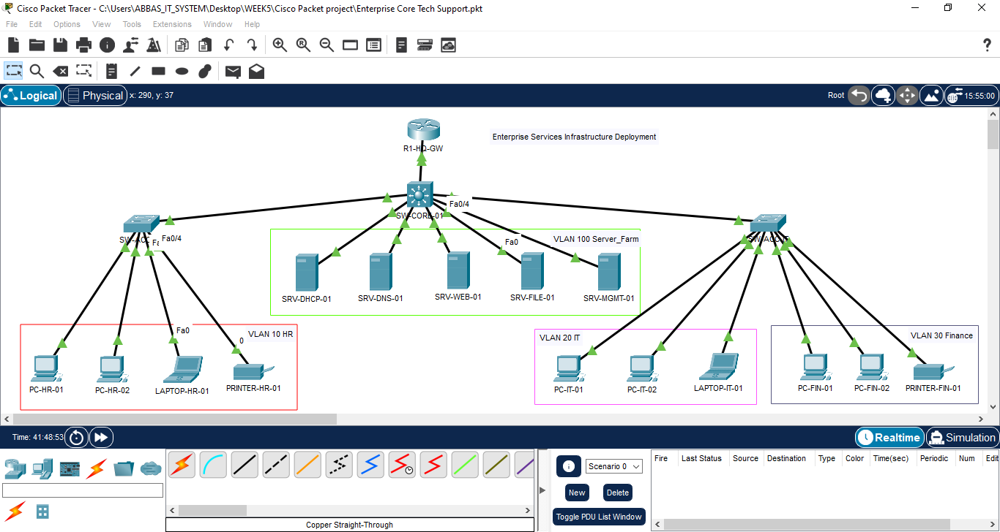

# 🌐 Enterprise Services Infrastructure Deployment

<div align="center">


**Network Administration Internship Program — IT-Simplera Institute**

*Centralized enterprise services deployed on a segmented, ACL-hardened multi-VLAN network*

</div>

---

## 📋 Table of Contents

- [Overview](#-overview)
- [Author & Program Details](#-author--program-details)
- [Project Objectives](#-project-objectives)
- [Network Topology](#-network-topology)
- [VLAN & IP Addressing Scheme](#-vlan--ip-addressing-scheme)
- [Server Farm Service Map](#-server-farm-service-map)
- [Enterprise Services Implemented](#-enterprise-services-implemented)
- [Security Design](#-security-design)
- [Configuration Highlights](#-configuration-highlights)
- [Verification & Testing](#-verification--testing)
- [Troubleshooting Log](#-troubleshooting-log)
- [Tools & Technologies](#-tools--technologies)
- [Skills Demonstrated](#-skills-demonstrated)
- [Repository Structure](#-repository-structure)
- [How to Use This Repo](#-how-to-use-this-repo)
- [Conclusion](#-conclusion)

---

## 🧭 Overview

This repository documents **Week 5** of the Network Administration Internship Program at **IT-Simplera Institute**, supervised by **Jawad Qayum (Senior Network Administrator)**.

Building directly on the four-VLAN, ACL-hardened topology established in Week 5, this project populates the central **Server Farm VLAN (VLAN 100)** with a full suite of **eight centralized enterprise services** — DHCP, DNS, HTTP/HTTPS, FTP, TFTP, NTP, Syslog, and SNMP — deployed and verified using **Cisco Packet Tracer**.

The result is a single-site enterprise network that is simultaneously:
- **Segmented** — HR, IT, and Finance departments isolated at Layer 3
- **Serviced** — every department consumes centralized DHCP, DNS, and web/file resources
- **Secured** — pre-existing Extended ACLs correctly extend to protect new management-plane services
- **Observable** — centralized logging, time sync, and SNMP monitoring from a single console

---

## 👤 Author & Program Details

| Field | Detail |
|---|---|
| **Submitted By** | Ghulam Abbas |
| **Registration No.** | NETB01-8085 |
| **Organization** | IT-Simplera Institute |
| **Supervisor** | Jawad Qayum, Senior Network Administrator |
| **Project Title** | Enterprise Services Infrastructure Deployment |
| **Week** | 05 |
| **Submission Date** | 28 July 2026 |

---

## 🎯 Project Objectives

- ✅ Design and deploy a centralized enterprise services infrastructure using Cisco Packet Tracer
- ✅ Configure and integrate DHCP, DNS, HTTP/HTTPS, FTP, TFTP, NTP, Syslog, and SNMP
- ✅ Implement secure access using existing ACL policies and enterprise best practices
- ✅ Verify functionality and interoperability of all services via end-to-end testing
- ✅ Troubleshoot and resolve service-related issues, documenting root cause and resolution

---

## 🗺️ Network Topology

The topology carries forward the **R1-HQ-GW** router-on-a-stick gateway, four VLANs, and access-layer switches from Week 4, with the Server Farm VLAN now fully populated.

```
                              ┌────────────────┐
                              │    R1-HQ-GW    │
                              │ (Router-on-a-  │
                              │     stick)     │
                              └───────┬────────┘
                                      │ 802.1Q Trunk
                     ┌────────────────┼────────────────┐
                     │                │                │
              ┌──────┴─────┐   ┌──────┴──────┐  ┌──────┴──────┐
              │  SW-ACCESS  │   │ SW-CORE/SRV │  │  SW-ACCESS  │
              └──────┬──────┘   └──────┬──────┘  └──────┬──────┘
        ┌─────────────┤          ┌─────┼─────┬────┬────┐    ├─────────────┐
   VLAN 10 (HR)        │    SRV-DHCP SRV-DNS SRV-WEB SRV-FILE SRV-MGMT   VLAN 30 (Finance)
   PC-HR-01/02          │    .10      .20     .30     .40      .50        PC-FIN-01/02
   LAPTOP-HR-01         │         VLAN 100 — Server Farm            PRINTER-FIN-01
   PRINTER-HR-01        │
                    VLAN 20 (IT & Engineering)
                    PC-IT-01/02, LAPTOP-IT-01
```


---

## 🧮 VLAN & IP Addressing Scheme

| VLAN | Department / Purpose | Subnet | Gateway (Sub-Interface) |
|:---:|---|---|---|
| 10 | Human Resources (HR) | `10.10.10.0/24` | Gi0/0/0.10 — `10.10.10.1` |
| 20 | IT & Engineering | `10.10.20.0/24` | Gi0/0/0.20 — `10.10.20.1` |
| 30 | Finance & Accounts | `10.10.30.0/24` | Gi0/0/0.30 — `10.10.30.1` |
| 100 | Server Farm & Management | `10.10.100.0/24` | Gi0/0/0.100 — `10.10.100.1` |

---

## 🖥️ Server Farm Service Map

| Server | IP Address | Service(s) Hosted | Access Scope |
|---|:---:|---|---|
| `SRV-DHCP` | `10.10.100.10` | DHCP | All departments (HR, IT, Finance) |
| `SRV-DNS` | `10.10.100.20` | DNS (zone: `itsimplera.local`) | All departments |
| `SRV-WEB` | `10.10.100.30` | HTTP / HTTPS | All departments |
| `SRV-FILE` | `10.10.100.40` | FTP / TFTP | All departments |
| `SRV-MGMT` | `10.10.100.50` | NTP / Syslog / SNMP | **IT (VLAN 20) only** — denied to HR & Finance |

---

## ⚙️ Enterprise Services Implemented

### 1. DHCP — Dynamic Host Configuration Protocol
Three department-specific pools (`POOL_HR`, `POOL_IT`, `POOL_FINANCE`) configured on `SRV-DHCP`. Since the server resides in a different subnet (VLAN 100) than its clients, `ip helper-address` relay was configured on each department's gateway sub-interface.

```
interface GigabitEthernet0/0/0.10
 ip helper-address 10.10.100.10
interface GigabitEthernet0/0/0.20
 ip helper-address 10.10.100.10
interface GigabitEthernet0/0/0.30
 ip helper-address 10.10.100.10
```

**Verified:** `ipconfig /all` on clients in each VLAN confirms leased addresses, correct gateway, and DNS server.

### 2. DNS — Domain Name System
`SRV-DNS` hosts the `itsimplera.local` zone with an **A record** (`itsimplera.local → 10.10.100.30`) and a **CNAME** (`www.itsimplera.local`), enabling name-based access to the intranet portal.

**Verified:** `ping www.itsimplera.local` resolves and replies from `10.10.100.30`.

### 3. HTTP / HTTPS — Web Services
`SRV-WEB` serves an intranet homepage (`index.html`) over both **TCP 80** and **TCP 443**, reachable by all departments as a shared resource.

**Verified:** Browser on any client successfully loads `http://www.itsimplera.local`.

### 4. FTP — File Transfer Protocol
`SRV-FILE` hosts an authenticated FTP service with a dedicated service account for configuration backup uploads/downloads.

| Username | Password | Permissions |
|---|---|---|
| `admin` | `Cisco123` | Read / Write / Delete / Rename / List |

**Verified:** `ftp 10.10.100.40` session from `PC-IT-01` — successful `put` and `get` operations.

### 5. TFTP — Trivial File Transfer Protocol
Enabled alongside FTP on `SRV-FILE`, used for router configuration backup/restore.

```
R1-HQ-GW# copy running-config tftp
Address or name of remote host []? 10.10.100.40
Destination filename [r1-hq-gw-confg]?
```

**Verified:** Backup file appears in the TFTP root directory; `copy tftp running-config` restore succeeds.

### 6. NTP — Network Time Protocol
`SRV-MGMT` acts as the authoritative time source; `R1-HQ-GW` configured as an NTP client.

```
ntp server 10.10.100.50
clock timezone PKT 3 0
```

**Verified:** `show ntp status` confirms `Clock is synchronized`.

### 7. Syslog — Centralized Logging
`R1-HQ-GW` forwards all severity 6 (informational) and above events to `SRV-MGMT`.

```
logging host 10.10.100.50
logging trap informational
logging on
service timestamps log datetime msec
```

**Verified:** `%SYS-5-CONFIG_I` events appear on the SRV-MGMT Syslog panel with accurate timestamps.

### 8. SNMP — Simple Network Management Protocol
Read-only and read-write community strings configured on `R1-HQ-GW`; `SRV-MGMT` polls the router via MIB browser.

```
snmp-server community public RO
snmp-server community private RW
snmp-server host 10.10.100.50 public
snmp-server enable traps
```

**Verified:** SNMP GET on `.1.3.6.1.2.1.1.1.0` (sysDescr) returns the router's IOS platform string.

---

## 🔐 Security Design

Two **Extended ACLs** carried forward from Week 4 remain bound inbound on the department sub-interfaces:

| ACL Name | Applied Interface | Function |
|---|---|---|
| `RESTRICT_HR` | Gi0/0/0.10 | Blocks HR ↔ Finance traffic; denies HR access to `10.10.100.50` |
| `RESTRICT_FINANCE` | Gi0/0/0.30 | Blocks Finance ↔ HR traffic; denies Finance access to `10.10.100.50` |

Both ACLs **permit** all traffic to DHCP, DNS, Web, and File services while explicitly **denying** access to the management host — meaning the Week 5 rollout inherits zero-trust departmental isolation **without any ACL rule changes**, other than validating that NTP/Syslog/SNMP correctly remain IT-only.

---

## ✅ Verification & Testing

### Connectivity & Service Matrix

| Source | Destination / Service | Test | Expected Result |
|---|---|---|---|
| PC-HR-01 | SRV-DHCP `10.10.100.10` | DHCP lease | Address from `POOL_HR` |
| PC-HR-01 | SRV-DNS `10.10.100.20` | `ping www.itsimplera.local` | Resolves to `10.10.100.30` |
| PC-HR-01 | SRV-WEB `10.10.100.30` | HTTP & HTTPS | Intranet page loads |
| PC-HR-01 | SRV-FILE `10.10.100.40` | FTP login | Permitted (shared resource) |
| PC-HR-01 | SRV-MGMT `10.10.100.50` | Ping / NTP / Syslog / SNMP | **Blocked** — `RESTRICT_HR` |
| PC-FIN-01 | SRV-MGMT `10.10.100.50` | Ping / NTP / Syslog / SNMP | **Blocked** — `RESTRICT_FINANCE` |
| PC-FIN-01 | SRV-DHCP / DNS / WEB / FILE | Full-service access | Permitted |
| PC-IT-01 | SRV-MGMT `10.10.100.50` | Ping / NTP / Syslog / SNMP | Permitted (admin access) |
| PC-IT-01 | All Server Farm hosts | Full-service access | Permitted |
| PC-HR-01 | PC-FIN-01 | Inter-VLAN ping | **Blocked** — `RESTRICT_HR` |


> 📸 See `/screenshots` for the full Cisco Packet Tracer capture.

### CLI Verification Commands Used

```
show ip interface brief
show access-lists
show ntp status
show clock detail
show running-config | section logging
show running-config | section snmp
ipconfig /all
ping / tracert
```

---

## 🛠️ Troubleshooting Log

| Issue Observed | Root Cause | Resolution | Verified By |
|---|---|---|---|
| HR & Finance clients did not receive a DHCP lease | No `ip helper-address` on department sub-interfaces | Added `ip helper-address 10.10.100.10` to Gi0/0/0.10, .20, .30 | `ipconfig /all` showing valid leased address |
| SNMP polling from SRV-MGMT timed out | Mismatched community string | Re-matched community string `public` on both ends | Successful SNMP poll returning interface/uptime data |
| Syslog messages not appearing on SRV-MGMT | Default trap severity excluded informational logs | Set `logging trap informational` on R1-HQ-GW | `%SYS-5-CONFIG_I` event visible after config change |
| NTP/Syslog/SNMP unreachable from HR & Finance | Expected — ACLs explicitly deny traffic to `10.10.100.50` | No change required (by design) | `show access-lists` deny counters incrementing |

---

## 🧰 Tools & Technologies

**Simulation Platform:** Cisco Packet Tracer

**Simulated Devices:**
- 1 × Router-on-a-stick gateway (`R1-HQ-GW`) with 802.1Q sub-interfaces
- Access-layer switches for HR, IT, Finance, and the Server Farm
- 5 × Generic Servers: `SRV-DHCP`, `SRV-DNS`, `SRV-WEB`, `SRV-FILE`, `SRV-MGMT`
- End-user PCs, laptops, and a network printer per department

**Protocols & Standards:** DHCP · DNS · HTTP · HTTPS · FTP · TFTP · NTP · Syslog · SNMP · IEEE 802.1Q Trunking · Extended IP ACLs

---

## 💡 Skills Demonstrated

- Deploying and integrating multiple centralized network services on a segmented enterprise topology
- Configuring DHCP relay (`ip helper-address`) for cross-subnet address assignment
- Building and querying DNS zone records for name-based service access
- Applying and validating layered security across pre-existing and newly deployed services
- Using centralized logging (Syslog) and monitoring (SNMP) for operational visibility
- Producing structured technical documentation, verification matrices, and troubleshooting reports

---

## 📁 Repository Structure

```
enterprise-services-infrastructure-week5/
├── README.md                          # This file
├── report/
│   └── Enterprise_Services_Infrastructure_Report.pdf
├── packet-tracer/
│   └── Enterprise_Core_Tech_Support.pkt
├── configs/
│   ├── R1-HQ-GW-running-config.txt
│   └── r1-hq-gw-backup.cfg
└── screenshots/
    ├── figure-01-topology.png
    ├── figure-02-dhcp-pools.png
    ├── figure-03-04-dhcp-verification.png
    ├── figure-05-dns-records.png
    ├── figure-06-07-dns-verification.png
    ├── figure-08-09-http-https.png
    ├── figure-10-11-ftp.png
    ├── figure-12-tftp.png
    ├── figure-13-14-ntp.png
    ├── figure-15-syslog.png
    ├── figure-16-17-snmp.png
    ├── figure-18-19-acl-verification.png
    └── figure-20-access-lists.png
```

---

## 🚀 How to Use This Repo

1. Clone the repository:
   ```
   git clone https://github.com/<your-username>/enterprise-services-infrastructure-week5.git
   ```
2. Open `packet-tracer/Enterprise_Core_Tech_Support.pkt` in **Cisco Packet Tracer** (v8.x recommended).
3. Review `report/Enterprise_Services_Infrastructure_Report.pdf` for the full write-up, configuration steps, and verification evidence.
4. Reference `configs/` for router-side CLI commands used across all eight services.

---

## 🏁 Conclusion

Week 5 successfully extended the segmented, ACL-hardened enterprise network built in Week 4 into a fully functional services infrastructure. DHCP, DNS, HTTP/HTTPS, FTP, TFTP, NTP, Syslog, and SNMP were deployed on the Server Farm VLAN and verified as reachable from HR, IT, and Finance where intended, while the existing management-plane lockdown correctly carried over to the newly added NTP, Syslog, and SNMP services.

The result is a network that is not only isolated and access-controlled, but also **centrally administered, monitored, and time-synchronized** — reflecting real-world enterprise operational practice.

---

<div align="center">

**Ghulam Abbas** | Network Administration Intern | IT-Simplera Institute

*Supervised by Jawad Qayum, Senior Network Administrator*

</div>
